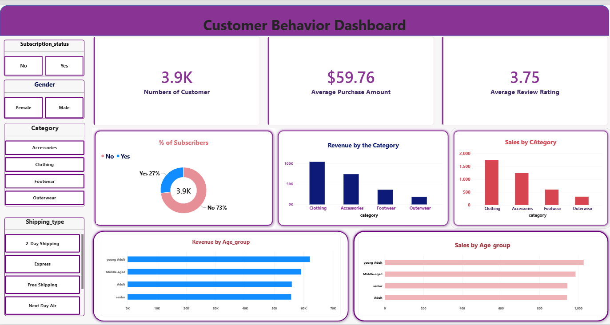

# Customer Shopping Behaviour Analysis

> **End-to-end Data Analytics Project using Python, SQL Server, and
> Power BI**

This project analyzes a customer shopping behaviour dataset to
understand purchasing patterns, customer segments, product performance,
discounts, subscriptions, shipping preferences, age-group behaviour, and
other business-focused trends.

The project demonstrates a complete analytics workflow:

**CSV Dataset → Python/Jupyter → SQL Server → Power BI Dashboard →
Business Insights**

------------------------------------------------------------------------

## 📌 Project Overview

The objective of this project is to transform raw customer shopping data
into useful, understandable business insights.

The analysis covers:

-   Customer demographics
-   Product and category performance
-   Purchase behaviour
-   Revenue analysis
-   Customer segmentation
-   Discount usage
-   Subscription behaviour
-   Shipping preferences
-   Payment methods
-   Purchase frequency
-   Review ratings
-   Age-group analysis

The project combines **Python for data preparation and exploratory
analysis**, **SQL Server for structured business analysis**, and **Power
BI for interactive visualization**.

------------------------------------------------------------------------

## 🛠️ Tools & Technologies

  Tool / Technology       Purpose
  ----------------------- ------------------------------------------------------
  **Python**              Data preparation and analysis
  **Jupyter Notebook**    Interactive analytics workflow
  **Pandas**              Data loading, cleaning, transformation, and analysis
  **NumPy**               Numerical/data processing support
  **SQL Server / SSMS**   Database storage and SQL analysis
  **SQL**                 Business questions and analytical queries
  **SQLAlchemy**          Python-to-SQL Server database connection
  **pyodbc**              SQL Server connectivity through ODBC
  **Power BI**            Interactive dashboard and visualization
  **CSV**                 Source dataset

------------------------------------------------------------------------

## 📁 Project Files

The project contains four primary working files:

``` text
Customershoppingbehaviour_analysis/
│
├── CustomerShoppingBehavior.csv
├── CustomerShoppingDB.sql
├── Data_Analysis.ipynb
├── PowerBI_CustomerShoppingBehavior_Dashboard.pbix
└── README.md
```

### 1. `CustomerShoppingBehavior.csv`

This is the source dataset used for the analysis.

**Dataset size:**

-   **3,900 records**
-   **18 original columns**
-   **3,900 unique Customer IDs**
-   **25 unique products**
-   **4 product categories**
-   **50 locations**
-   Age range: **18--70 years**

The original dataset contains:

  Column                     Description
  -------------------------- -------------------------------------
  `Customer ID`              Unique customer identifier
  `Age`                      Customer age
  `Gender`                   Customer gender
  `Item Purchased`           Product purchased
  `Category`                 Product category
  `Purchase Amount (USD)`    Amount spent on the purchase
  `Location`                 Customer location
  `Size`                     Product size
  `Color`                    Product colour
  `Season`                   Season associated with the purchase
  `Review Rating`            Customer review rating
  `Subscription Status`      Whether the customer is subscribed
  `Shipping Type`            Selected shipping method
  `Discount Applied`         Whether a discount was applied
  `Promo Code Used`          Whether a promo code was used
  `Previous Purchases`       Number of previous purchases
  `Payment Method`           Payment method used
  `Frequency of Purchases`   Customer purchase frequency

------------------------------------------------------------------------

# 🔎 Data Quality & Preparation

The Jupyter Notebook checks the dataset structure using:

-   `head()`
-   `info()`
-   `describe()`
-   `isnull().sum()`

### Missing Values

The dataset contains **no missing values across the 18 original
columns**.

Therefore, the notebook does not perform missing-value imputation.

The notebook also documents how missing values *could* be handled if
they existed, using approaches such as:

-   Removing records
-   Mean/median/mode imputation
-   Group-based median imputation
-   Other appropriate techniques depending on the data

### Column Standardization

The notebook standardizes column names by:

1.  Converting column names to lowercase
2.  Replacing spaces with underscores
3.  Renaming `purchase_amount_(usd)` to `purchase_amount`

For example:

``` text
Purchase Amount (USD)
        ↓
purchase_amount
```

------------------------------------------------------------------------

# 🧹 Feature Engineering

The Jupyter Notebook creates additional analytical columns.

## 1. Age Group

Customers are divided into four age groups using quartile-based binning
(`pd.qcut`):

-   Young Adult
-   Adult
-   Middle-aged
-   Senior

This makes age-based comparisons easier in SQL and Power BI.

## 2. Purchase Frequency in Days

The notebook converts purchase-frequency categories into approximate day
intervals:

  Frequency          Days
  ---------------- ------
  Weekly                7
  Fortnightly          14
  Bi-Weekly            14
  Monthly              30
  Quarterly            90
  Every 3 Months       90
  Annually            365

This creates the analytical column:

``` text
purchase_frequency_days
```

## 3. Promo Code Column

The notebook checks whether:

``` text
Discount Applied
```

and

``` text
Promo Code Used
```

contain identical values for every record.

The check returns true, so the notebook removes `promo_code_used` from
the working DataFrame to avoid redundant information.

------------------------------------------------------------------------

# 🐍 Jupyter Notebook Workflow

The notebook `Data_Analysis.ipynb` follows this sequence:

### Step 1 --- Import Libraries

``` python
import pandas as pd
```

### Step 2 --- Inspect the Working Directory

The notebook checks the current working directory and available files.

### Step 3 --- Load the CSV

``` python
df = pd.read_csv("CustomerShoppingBehavior.csv")
```

### Step 4 --- Explore the Dataset

The notebook uses:

``` python
df.head()
df.info()
df.describe(include='all')
df.isnull().sum()
```

### Step 5 --- Clean Column Names

Column names are standardized for easier Python and SQL usage.

### Step 6 --- Create Analytical Features

The notebook creates:

-   `age_group`
-   `purchase_frequency_days`

and removes the redundant `promo_code_used` field.

### Step 7 --- Connect Python to SQL Server

The notebook uses:

-   `SQLAlchemy`
-   `pyodbc`
-   Microsoft SQL Server
-   ODBC Driver 18 for SQL Server

The database connection is configured for:

``` text
Server: HIMANSHU\SQLEXPRESS
Database: CustomerShoppingDB
Authentication: Windows Trusted Connection
```

### Step 8 --- Upload Data to SQL Server

The cleaned DataFrame is uploaded to:

``` text
CustomerShoppingDB
    └── CustomerShoppingBehavior
```

### Step 9 --- Validate SQL Data

The notebook executes SQL queries to check:

-   Top records
-   Total number of records
-   Total sales
-   Average purchase amount
-   Sales by category

------------------------------------------------------------------------

# 🗄️ SQL Server Analysis

The file `CustomerShoppingDB.sql` contains **10 business-focused SQL
questions**.

## Q1. Revenue by Gender

Compares total revenue generated by male and female customers.

**SQL concepts:** `SUM()`, `GROUP BY`, `ORDER BY`

------------------------------------------------------------------------

## Q2. Discounted Customers Spending Above Average

Identifies customers who:

-   Received a discount
-   Spent more than the overall average purchase amount

**SQL concepts:** `WHERE`, subquery, `AVG()`

------------------------------------------------------------------------

## Q3. Top 5 Products by Average Review Rating

Finds the five products with the highest average review ratings.

**SQL concepts:** `TOP`, `AVG()`, `GROUP BY`, `ORDER BY`

------------------------------------------------------------------------

## Q4. Standard vs Express Shipping

Compares average purchase amount for:

-   Standard Shipping
-   Express Shipping

**SQL concepts:** filtering with `IN`, `AVG()`, `GROUP BY`

------------------------------------------------------------------------

## Q5. Subscription Spending Analysis

Compares subscribed and non-subscribed customers using:

-   Average spend
-   Total revenue
-   Customer count

------------------------------------------------------------------------

## Q6. Products with the Highest Discount Percentage

Calculates the percentage of purchases receiving discounts for each
product and identifies the top five.

**SQL concepts:** `CASE`, `COUNT()`, `SUM()`, percentage calculation,
`CAST()`

------------------------------------------------------------------------

## Q7. New, Returning and Loyal Customers

Creates customer segments based on previous purchases:

    Previous Purchases Segment
  -------------------- -----------
                  0--5 New
                 6--20 Returning
                   21+ Loyal

------------------------------------------------------------------------

## Q8. Top 3 Products Within Each Category

Identifies the three most-purchased products inside every category.

This query demonstrates a SQL **window function**:

``` sql
ROW_NUMBER() OVER (
    PARTITION BY category
    ORDER BY purchase_count DESC
)
```

------------------------------------------------------------------------

## Q9. Repeat Buyers and Subscription Rate

Compares:

-   Repeat Buyers: more than 5 previous purchases
-   Non-Repeat Buyers: 5 or fewer previous purchases

It calculates the subscription rate for each group.

------------------------------------------------------------------------

## Q10. Revenue Contribution by Age Group

Calculates:

-   Total revenue for each age group
-   Percentage contribution to overall revenue

This helps understand which age groups contribute most to total sales.

------------------------------------------------------------------------

# 📊 Key Dataset-Level Findings

The following figures are calculated directly from the supplied CSV
dataset.

  Metric                              Value
  ------------------------- ---------------
  Total Records                       3,900
  Unique Customers                    3,900
  Total Purchase Revenue      **\$233,081**
  Average Purchase Amount       **\$59.76**
  Median Purchase Amount        **\$60.00**
  Average Review Rating        **3.75 / 5**
  Age Range                      **18--70**
  Product Categories                  **4**
  Unique Products                    **25**
  Locations                          **50**

### Revenue by Gender

  Gender       Revenue
  -------- -----------
  Male       \$157,890
  Female      \$75,191

### Revenue by Category

  Category          Revenue
  ------------- -----------
  Clothing        \$104,264
  Accessories      \$74,200
  Footwear         \$36,093
  Outerwear        \$18,524

### Subscription

  Subscription Status     Customers     Revenue
  --------------------- ----------- -----------
  No                          2,847   \$170,436
  Yes                         1,053    \$62,645

The average purchase amount in the supplied data is approximately
**\$59.87 for non-subscribed customers** and **\$59.49 for subscribed
customers**.

> These figures describe the supplied dataset; they should not be
> interpreted as general consumer-market statistics.

------------------------------------------------------------------------

# 👥 Customer Segmentation

Using the project's previous-purchase logic:

  Segment       Customers
  ----------- -----------
  New                 424
  Returning         1,137
  Loyal             2,339

This segmentation is used to understand differences in purchasing
behaviour and subscription patterns.

------------------------------------------------------------------------

# 📈 Power BI Dashboard

The file:

``` text
PowerBI_CustomerShoppingBehavior_Dashboard.pbix
```

contains the interactive Power BI report.

The supplied PBIX contains a dashboard page with KPI cards, charts,
slicers, and customer-shopping analysis visuals.

### Dashboard elements include

-   Customer count KPI
-   Average purchase amount KPI
-   Average review rating KPI
-   Subscription analysis
-   Sales by category
-   Revenue by age group
-   Sales/customer analysis by age group
-   Category slicer
-   Shipping type slicer
-   Interactive filtering

### Dashboard Design

The report uses a customized Power BI theme and consistent
typography/formatting.

The slicers are designed as selectable tiles, allowing users to
interactively filter the report.

## 📊 Power BI Dashboard


------------------------------------------------------------------------

# 🔄 Complete Project Workflow

``` text
                 RAW DATA
                    │
                    ▼
        CustomerShoppingBehavior.csv
                    │
                    ▼
             PYTHON / JUPYTER
                    │
       ┌────────────┴────────────┐
       │                         │
 Data Quality              Feature Engineering
       │                         │
       └────────────┬────────────┘
                    ▼
             Cleaned Dataset
                    │
                    ▼
             SQL SERVER / SSMS
                    │
          Business SQL Analysis
                    │
                    ▼
              POWER BI
                    │
        Interactive Dashboard
                    │
                    ▼
             BUSINESS INSIGHTS
```

------------------------------------------------------------------------

# 🎯 Business Questions Addressed

This project answers questions such as:

1.  How much revenue is generated by different genders?
2.  Which discounted customers spend above average?
3.  Which products have the highest review ratings?
4.  How does average spending differ by shipping type?
5.  Do subscribed customers spend more?
6.  Which products receive discounts most frequently?
7.  How many customers are new, returning, or loyal?
8.  What are the top products within each category?
9.  Are repeat buyers more likely to subscribe?
10. Which age groups contribute most to revenue?

------------------------------------------------------------------------

# 💡 Important Insights from the Supplied Data

-   The dataset contains **3,900 customer purchase records**.
-   Total recorded purchase revenue is **\$233,081**.
-   **Clothing** contributes the highest revenue among the four
    categories.
-   The dataset contains **25 unique products** across **4 categories**.
-   There are **1,053 subscribed** and **2,847 non-subscribed** records.
-   The largest customer segment under the project's defined rules is
    **Loyal**, with 2,339 records.
-   **Male customers account for \$157,890** of the recorded revenue,
    while female customers account for \$75,191.
-   The average review rating across the dataset is approximately
    **3.75**.
-   The age-based analysis shows the **18--31** quartile group
    contributing the highest recorded revenue among the four generated
    age groups.

------------------------------------------------------------------------

# 📌 Project Limitations

This project is based on the supplied dataset and its available fields.

Important limitations include:

-   The dataset represents recorded purchase observations rather than a
    full real-world customer history.
-   No purchase date column is present, so true time-series sales trends
    cannot be calculated.
-   Revenue is based on the `Purchase Amount (USD)` field in the
    supplied data.
-   Customer segmentation is rule-based using `Previous Purchases`.
-   Age groups are created using quartiles rather than predefined
    business age ranges.
-   The project does not establish causation; relationships in the data
    should be interpreted as descriptive patterns.

------------------------------------------------------------------------

# 🚀 How to Run the Project

## 1. Clone or Download the Project

Keep the following files together:

``` text
CustomerShoppingBehavior.csv
CustomerShoppingDB.sql
Data_Analysis.ipynb
PowerBI_CustomerShoppingBehavior_Dashboard.pbix
```

## 2. Run the Jupyter Notebook

Open:

``` text
Data_Analysis.ipynb
```

Make sure the CSV file is available in the notebook's working directory.

Install required Python packages if necessary:

``` bash
pip install pandas sqlalchemy pyodbc
```

## 3. Configure SQL Server

The notebook is configured for:

``` text
HIMANSHU\SQLEXPRESS
```

and:

``` text
CustomerShoppingDB
```

If the project is moved to another computer, update the server/database
connection details accordingly.

## 4. Run the SQL Queries

Open:

``` text
CustomerShoppingDB.sql
```

in SQL Server Management Studio and run the queries against:

``` text
CustomerShoppingDB
```

The SQL script expects the `CustomerShoppingBehavior` table to be
available.

## 5. Open the Power BI Dashboard

Open:

``` text
PowerBI_CustomerShoppingBehavior_Dashboard.pbix
```

If the data source or SQL Server instance is different on another
computer, update the Power BI data-source connection.

------------------------------------------------------------------------

# 📂 Recommended Folder Structure

``` text
Data_Analyst_Project_/
│
└── Customershoppingbehaviour_analysis/
    │
    ├── CustomerShoppingBehavior.csv
    ├── CustomerShoppingDB.sql
    ├── Data_Analysis.ipynb
    ├── PowerBI_CustomerShoppingBehavior_Dashboard.pbix
    └── README.md
```

This keeps all project components together and makes the project easy to
share, review, or upload to GitHub.

------------------------------------------------------------------------

# 🧠 Skills Demonstrated

This project demonstrates practical skills in:

-   Data Cleaning
-   Exploratory Data Analysis (EDA)
-   Python
-   Pandas
-   Data Transformation
-   Feature Engineering
-   SQL
-   SQL Server
-   SSMS
-   SQL Subqueries
-   SQL Aggregations
-   SQL Window Functions
-   Customer Segmentation
-   Business Analysis
-   KPI Development
-   Data Visualization
-   Power BI
-   Interactive Dashboard Development
-   Data Storytelling

------------------------------------------------------------------------

# 📄 Project Summary for Portfolio

**Customer Shopping Behaviour Analysis** is an end-to-end data analytics
project that transforms raw customer shopping data into actionable
business insights. Python and Pandas are used for data inspection,
cleaning, transformation, and feature engineering. The processed data is
connected to SQL Server for business-oriented analysis using
aggregation, subqueries, conditional logic, and window functions. Power
BI is then used to create an interactive dashboard for KPI tracking,
category analysis, age-group analysis, subscription analysis, and
customer behaviour exploration.

------------------------------------------------------------------------

## 👨‍💻 Project Type

**Data Analytics / Business Intelligence**

### Core Technologies

**Python \| Pandas \| Jupyter Notebook \| SQL Server \| SSMS \| SQL \|
SQLAlchemy \| pyodbc \| Power BI**

------------------------------------------------------------------------

> **Note:** All numerical findings in this README are calculated from
> the supplied `CustomerShoppingBehavior.csv`. Dashboard descriptions
> are based on the supplied `.pbix` report structure, while the workflow
> and transformation descriptions are based on the supplied Jupyter
> Notebook and SQL file.
